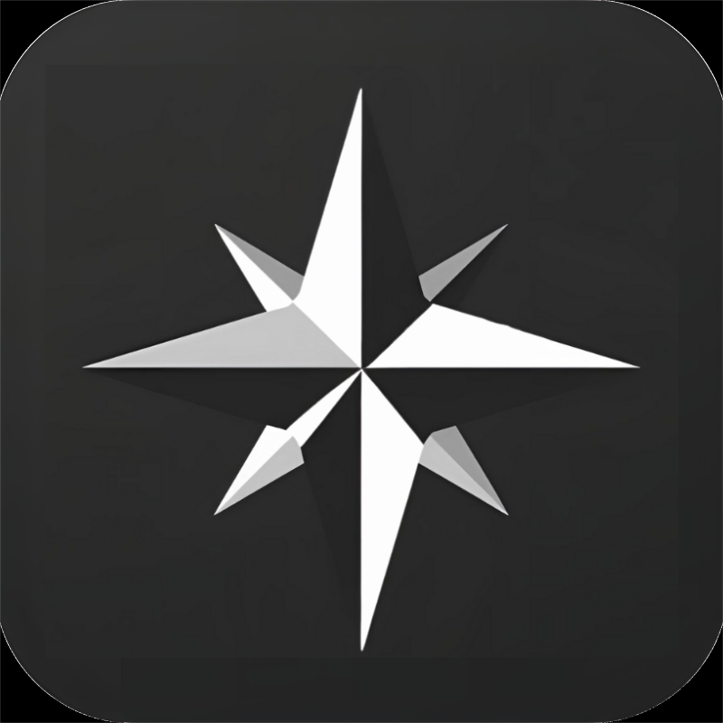

<p align="center">
  <a href="#" target="_blank">
    
  </a>
</p>

<h1 align="center">Scribe: Your Personal Knowledge Graph</h1>

<p align="center">
  A modern, interconnected note-taking application built with Laravel, designed to help you organize your thoughts, ideas, and knowledge in a meaningful way.
</p>

<p align="center">
  <a href="#key-features">Features</a> •
  <a href="#technologies-used">Tech Stack</a> •
  <a href="#installation">Installation</a> •
  <a href="#usage">Usage</a> •
  <a href="#project-structure">Structure</a> •
  <a href="#license">License</a>
</p>

---

## ✨ Project Overview

Scribe is more than just a note-taking app; it's a tool to build your personal knowledge graph. It allows users to create, tag, and link notes together, transforming scattered information into an organized, interconnected web of knowledge. Whether you're a student, researcher, or just someone who loves to learn, Scribe helps you connect the dots between your ideas.

This project was developed as a final university submission, showcasing a comprehensive understanding of modern web application development principles.

## 🚀 Key Features

*   **Intuitive Note Creation**: Easily create and manage notes with a clean interface.
*   **Tagging System**: Organize your notes with custom tags for quick categorization and retrieval.
*   **Interconnected Notes**: Link related notes together to build a personal knowledge graph, revealing relationships between your ideas.
*   **User Authentication**: Secure user registration, login, and profile management.
*   **Dashboard Overview**: A personalized dashboard providing quick insights into your notes, tags, and note links.
*   **Responsive Design**: A clean and responsive user interface built with Tailwind CSS.

## 💻 Technologies Used

*   **Backend**:
    *   [Laravel](https://laravel.com/) ^12.0 (PHP Framework)
    *   [Eloquent ORM](https://laravel.com/docs/eloquent)
*   **Frontend**:
    *   [Blade Templates](https://laravel.com/docs/blade)
    *   [Tailwind CSS](https://tailwindcss.com/) (Utility-First CSS Framework)
    *   [Vite](https://vitejs.dev/) (Frontend Build Tool)
    *   [Alpine.js](https://alpinejs.dev/) (JavaScript Framework)
    *   JavaScript
    *   Axios (HTTP Client)
*   **Database**:
    *   SQLite (default, configurable)
*   **Build Tools**:
    *   [Composer](https://getcomposer.org/) (PHP Dependency Manager)
    *   [npm](https://www.npmjs.com/) (Node.js Package Manager)
    *   [Vite](https://vitejs.dev/) (Frontend Build Tool)
    *   [concurrently](https://www.npmjs.com/package/concurrently) (Run multiple commands concurrently)
    *   [laravel-vite-plugin](https://github.com/laravel/vite-plugin) (Laravel Vite Integration)
    *   [tailwindcss/typography](https://tailwindcss.com/docs/typography-plugin) (Tailwind CSS Typography Plugin)
    *   [tailwindcss/vite](https://tailwindcss.com/docs/installation#vite) (Tailwind CSS Vite Plugin)
*   **Other**:
    *   EasyMDE (Markdown Editor)
    *   Marked.js (Markdown Parser)

## ⚙️ Installation

Follow these steps to get Scribe up and running on your local machine.

### Prerequisites

*   PHP >= 8.2
*   Composer
*   Node.js & npm (or Yarn)

### Steps

1.  **Clone the repository:**
    ```bash
    git clone <repository_url>
    cd scribe
    ```

2.  **Install PHP dependencies:**
    ```bash
    composer install
    ```

3.  **Copy the environment file:**
    ```bash
    cp .env.example .env
    ```

4.  **Generate an application key:**
    ```bash
    php artisan key:generate
    ```

5.  **Configure your database:**
    *   Open the `.env` file and configure your database connection. By default, it uses SQLite. If you want to use SQLite, ensure you have a `database.sqlite` file in the `database/` directory (you can create it with `touch database/database.sqlite`).

6.  **Run database migrations and seeders:**
    ```bash
    php artisan migrate --seed
    ```
    (The `--seed` flag will populate your database with some initial data, including a default user: `test@example.com` / `password`).

7.  **Install Node.js dependencies:**
    ```bash
    npm install
    # OR yarn install
    ```

8.  **Compile frontend assets:**
    ```bash
    npm run dev
    # OR npm run build for production
    ```

9.  **Start the development server (all-in-one):**
    ```bash
    composer dev
    ```
    This command will concurrently run the Laravel development server, queue worker, logs, and Vite for frontend assets.

    Alternatively, you can run them separately:
    ```bash
    php artisan serve
    ```
    The application will be accessible at `http://127.0.0.1:8000`.

10. **Run Tests:**
    ```bash
    composer test
    ```

## 🚀 Usage

1.  **Register/Login**: Navigate to the application in your browser and register a new account or log in with the seeded user (`test@example.com` / `password`).
2.  **Dashboard**: Get an overview of your notes, tags, and note links.
3.  **Create Notes**: Go to the "Notes" section to create new notes. You can use Markdown for content.
4.  **Manage Tags**: Create and assign tags to your notes to categorize them.
5.  **Link Notes**: Connect related notes to build your knowledge graph.
6.  **Graph View**: Explore the relationships between your notes in the dedicated graph view.

## 📂 Project Structure

The project follows the standard Laravel directory structure, with key directories including:

*   `app/`: Core application logic (Models, Controllers, Policies).
*   `config/`: Application configuration files.
*   `database/`: Migrations, seeders, and factories.
*   `public/`: Web server entry point and compiled assets.
*   `resources/`: Frontend assets (Blade views, CSS, JS).
*   `routes/`: Web and authentication route definitions.

## 💡 Future Enhancements

*   Full-text search capabilities.
*   Real-time collaboration on notes.
*   More interactive and customizable graph visualization.
*   Note versioning and history.
*   Export notes to various formats.

## 🤝 Contributing

Contributions are welcome! If you have suggestions or find issues, please open an issue or submit a pull request.

## 📄 License

This project is open-sourced software licensed under the [MIT license](https://opensource.org/licenses/MIT).

---
<p align="center">Made with ❤️ by Tain Yan Tun</p>
